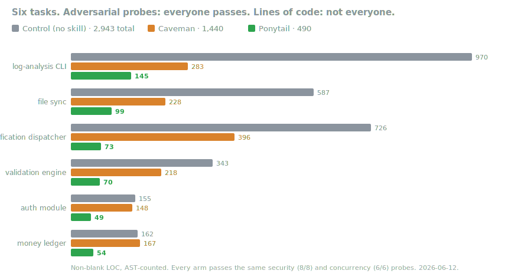

<p align="center">
  
</p>

<h1 align="center">Ponytail</h1>

<p align="center">
  <em>He says nothing. He writes one line. It works.</em>
</p>

---

You know him. Long ponytail. Oval glasses. Has been at the company longer than the version control. You show him fifty lines; he looks at them, says nothing, and replaces them with one.

Ponytail puts him inside your AI agent.

## Before / after

You ask for a date picker. Your agent installs flatpickr, writes a wrapper component, adds a stylesheet, and starts a discussion about timezones.

With ponytail:

```html
<!-- ponytail: browser has one -->
<input type="date">
```

More survivors in [examples/](examples/).

## How it works

Before writing code, the agent stops at the first rung that holds:

```
1. Does this need to exist?   → no: skip it (YAGNI)
2. Stdlib does it?            → use it
3. Native platform feature?   → use it
4. Installed dependency?      → use it
5. One line?                  → one line
6. Only then: the minimum that works
```

Lazy, not negligent: trust-boundary validation, data-loss handling, security, and accessibility are never on the chopping block.

## Install

The most effort ponytail will ever ask of you:

```
/plugin marketplace add DietrichGebert/ponytail
/plugin install ponytail@ponytail
```

That was it. He'd be proud. He won't say it.

Active every session. `/ponytail-review` finds what to delete in your diff. `/ponytail ultra` exists for when the codebase has wronged you personally. `/ponytail-help` explains the rest.

Cursor, Windsurf, Cline, Copilot, Aider: copy the matching rules file from this repo ([`.cursor/rules/`](.cursor/rules/), [`.windsurf/rules/`](.windsurf/rules/), [`.clinerules/`](.clinerules/), [`.github/copilot-instructions.md`](.github/copilot-instructions.md), [`AGENTS.md`](AGENTS.md)).

## FAQ

**Does it need a config file?**
No.

**What if I really need the 120-line cache class?**
You don't. Insist anyway and he'll build it — slowly, correctly, while looking at you.

**Does it scale?**
The code you never wrote scales infinitely. Zero bugs, zero CVEs, 100% uptime since forever.

**Why "ponytail"?**
You know exactly why.

## Numbers

5 coding tasks, same agent with and without ponytail: **−16% tokens, ~4× faster, 293 → 47 lines.** The 246 lines nobody wrote have never caused an incident.

Then six harder tasks — streaming parsers, atomic file sync, auth, a concurrent money ledger — against a no-skill control and the [caveman](https://github.com/JuliusBrussee/caveman) skill, with adversarial security and concurrency probes:

<p align="center">
  
</p>

Everyone passes every probe. Ponytail does it with a third of caveman's code, a sixth of control's, and was ~5× cheaper when the surprise feature request landed (96 lines changed vs 487 for control). Every shortcut is marked in-code with its upgrade path. Data: [benchmarks/](benchmarks/).

## License

[MIT](LICENSE). The shortest license that works.
